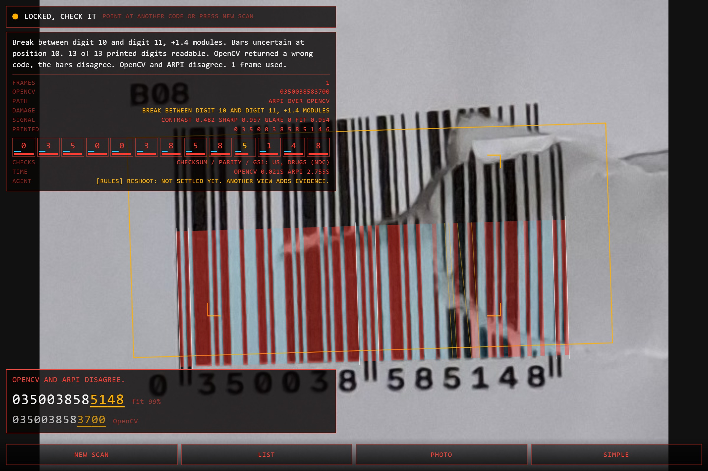
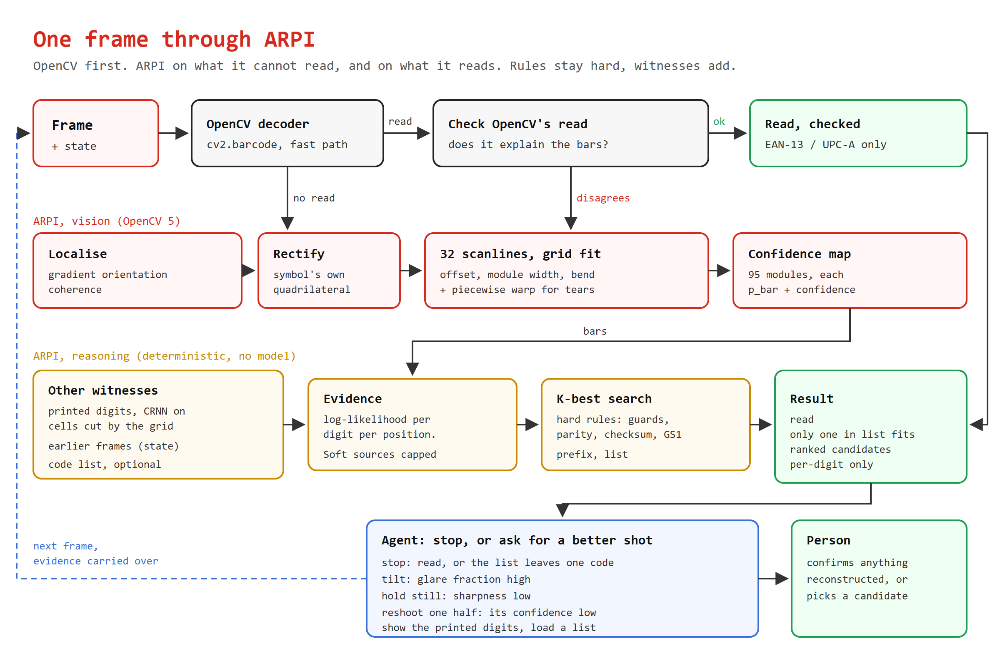
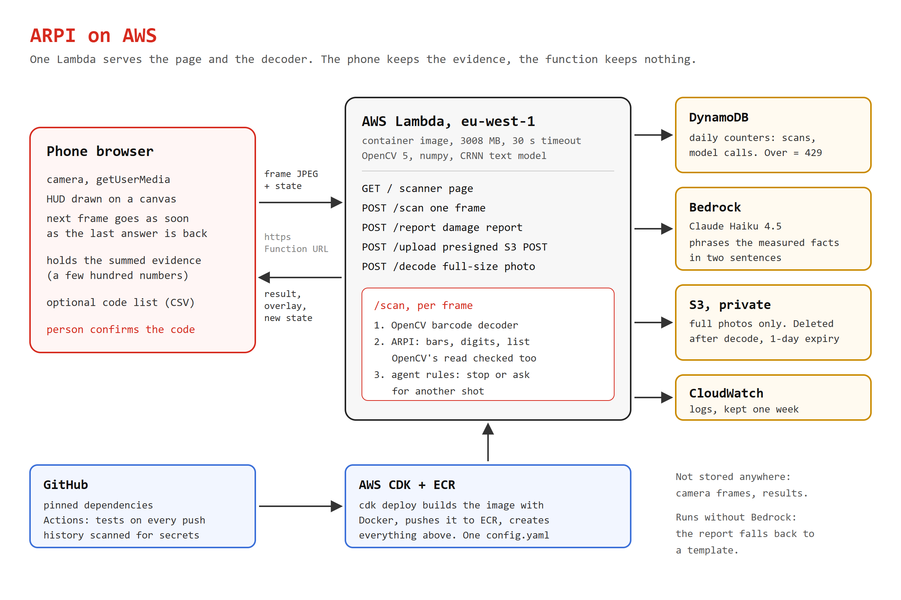

# ARPI

Reads barcodes that are too damaged to scan. When part of the code is gone, it
works out what the code must have been, shows its working, and lets a person
pick. It never asserts a code it had to fill in.

EAN-13 and UPC-A. OpenCV AI Competition 2026.

- Try it: https://eu2oqybdr2td26obiljef6xopu0jsmwo.lambda-url.eu-west-1.on.aws/ (on a phone, or "Use a photo" with the files in `submission/samples/`)
- Report: [submission/ARPI_report.pdf](submission/ARPI_report.pdf)
- Video: [fill: link]



A torn code from the test set. OpenCV reads 0350038583700, which passes its
checksum and is wrong. ARPI finds the tear, flags that the bars disagree, and
its top candidate 0350038585148 is what was printed.

## How it works

OpenCV's own decoder goes first and reads the easy codes. ARPI takes what it
cannot read, and also checks what it does read against the bars, because
OpenCV is sometimes wrong with a valid checksum.

ARPI localises the symbol, rectifies it, fits a module grid on 32 scanlines
and gives every one of the 95 modules a bar probability and a confidence. The
printed digits under the bars are read as a second witness (OpenCV DNN, CRNN).
Every source becomes a log-likelihood per digit per position, and an exact
K-best search keeps the hard rules hard: guards, parity, checksum, GS1 prefix,
and the customer's code list if one is loaded. Frames add up, so moving the
phone fills in what glare hid.

After each frame an agent decides to stop or to ask for a specific better
shot ("right half confidence 0.38, other half 1.00"). The rules make that
decision. Bedrock (Claude Haiku 4.5) only phrases the damage report.





## Results

Real photos of 72 printed and damaged codes, Samsung phone. Frozen in
[results/2026-10-05](results/2026-10-05/summary.md) with tool versions and
hashes. "Asserted" means it committed to one code; ranked candidates are not
counted.

| sheets, 240 codes | OpenCV | ARPI | ARPI + list | cascade, checked |
|---|---|---|---|---|
| right code first | 152 | 210 | 229 | 212 |
| asserted | 154 | 110 | 228 | 168 |
| asserted and wrong | 2 | 0 | 0 | 0 |

| singles, 210 crops | OpenCV | ARPI | ARPI + list | cascade | cascade + list |
|---|---|---|---|---|---|
| right code first | 160 | 188 | 196 | 186 | 194 |
| asserted | 161 | 103 | 194 | 162 | 190 |
| asserted and wrong | 1 | 0 | 0 | 0 | 0 |

Singles are each code cut out and run through the phone's path. 15 more
crops caught two labels and are not scored; in one of those ARPI answered the
neighbour's code. The report (section 9) has the details and the failure
cases.

## Run it locally

Python 3.12 or newer.

```bash
pip install -r requirements.txt
python tools/fetch_models.py      # CRNN text model, checked against its hash
python -m pytest                  # 63 tests, offline, no AWS
python tools/serve_local.py       # scanner page at http://localhost:8013
python -m arpi photo.jpg
python -m arpi photo.jpg --known submission/samples/known_codes.csv
```

A phone camera needs https, so locally use a desktop browser (webcam, or the
Photo button). `make help` lists the rest.

## Deploy to AWS

Needs Docker, Node (for `npx cdk`) and an AWS profile with Bedrock access in
the region.

```bash
aws sso login --profile <profile>
python tools/probe_bedrock.py --region eu-west-1 --test --write   # fills the model id in infra/config.yaml
python tools/fetch_models.py
cd infra && npx cdk deploy --profile <profile>
```

`cdk deploy` builds the container image, pushes it to ECR and creates the
Lambda with its Function URL, a private S3 bucket, a DynamoDB counter table,
the log group and the IAM policy. It prints the URL. `infra/config.yaml` is
the only place a region, model or limit is set. No account id is written
anywhere; CDK reads it from the profile.

## Evaluate

```bash
python tools/evaluate.py --n 8                              # synthetic sweep
python tools/eval_sheets.py data/physical/photos --cascade  # whole sheets
python tools/eval_singles.py data/physical/photos           # one code per crop
python tools/archive_results.py --date <yyyy-mm-dd>         # freeze a run
```

The physical photos are not in the repo. `data/physical/manifest.csv` lists
each one with its SHA-256, and `data/README.md` says how the set was printed,
damaged and shot, so it can be rebuilt with `tools/print_sheet.py`.

## Where things are

| | |
|---|---|
| `src/arpi/vision.py` | localise, rectify, grid fit, piecewise warp |
| `src/arpi/confmap.py` | the confidence map, the line between seeing and reasoning |
| `src/arpi/ocr.py` | printed digits, cut by geometry, CRNN via cv2.dnn |
| `src/arpi/evidence.py` | every source as a log-likelihood per digit |
| `src/arpi/candidates.py` | the K-best search and the constraint stack |
| `src/arpi/session.py` | frames of one label, fused |
| `src/arpi/cascade.py` | OpenCV first, and the check on its reads |
| `src/arpi/live.py` | the phone's path, one aimed code |
| `src/arpi/agent.py` | stop or ask for a better shot |
| `src/arpi/report.py` | the damage report, facts from code, wording from Bedrock |
| `src/arpi/handler.py`, `limits.py` | Lambda entry, spend caps |
| `web/index.html` | the scanner page |
| `infra/` | CDK stack and config |
| `tools/` | evaluation, print sheets, model fetch, secrets scan |
| `docs/` | report source, diagrams, [build log](docs/devlog.md) |
| `arpi.md` | the plan as written on 5 October |

## Limits

EAN-13 and UPC-A only. The physical set is small: 72 codes, one phone, one
day. Long codes curving round a tin, and payment barcodes read off a screen,
are the next two things, both Code 128.

MIT licence.
